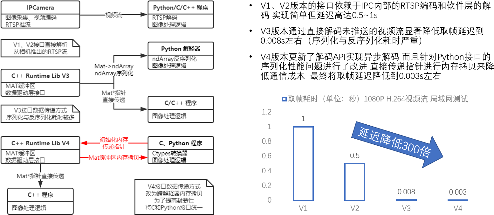

# IPCamera-CPython-Interface-v4

用的是海康的aarch64的sdk,才接h264,转yuv，再转rgb，保存图片。
注意，必须要用主码流40ms。注意ffmepg得编译成支持x264.

## 这是什么东西（What is this）

> * 兼容主流海康和雄迈IPC的适用于C、C++和python2/3的帧数据获取接口
> * 简化海康和雄迈IPC连接、登录、注册回调、解码（FFMPEG）、取帧的步骤
> * 通过Ctypes支持python3

## 近期更新（Recent update）

> * 现已将接口打包为deb安装包 可以实现一键编译安装（测试于Ubuntu 19.04/18.04.2 LTS）
> * 添加对不同分辨率的摄像头的支持 并且支持在运行过程中动态切换分辨率
> * 现在可以在客户端取不同分辨率的帧数据
> * 现在在申请对象时会对buffer初始化 来防止取帧过快导致客户端崩溃
> * 为进一步优化取帧效率 启用了多线程解码(ffmpeg4.0及以上版本默认解码线程为1)

## 性能对比（Performance comparison）

## 原理简要说明（Brief description of the principle）

* [数据驱动层IPC取帧接口说明.pptx](数据驱动层IPC取帧接口说明.pptx)

## 安装与测试（Install and testing）

* [使用release文件夹下的文件进行安装](release/Readme.md)
* 安装完后可以通过demo文件夹下的测试程序进行效果测试

## 接口调用方式（C/C++/Python）

* [海康IPC调用方式](hk_interface_v4/demo/README.md)
* [雄迈IPC调用方式](xm_interface_v4/demo/README.md)

## 目录结构说明（Files-Tree）

* hk_interface - 存放海康接口源码、测试demo、SDK
* xm_interface - 存放雄迈接口源码、测试demo、SDK
* deb_packager - 用于打包libipc的deb安装包
* py_packager - 用于打包libipc的python wheel安装包
* release - 包括ffmpeg、opencv的安装脚本和预编译的libipc安装包
* 每个关键子目录下都附带README文件

## 注意事项（Cautious）

* 使用内存管道方法配合`nginx_rtmp_module`推流延迟较高，需要低延迟推流可以考虑使用[基于类MJPEG协议的推流框架](...)
* 在Ubuntu 18.04上安装openCV可以参考[这个链接](https://www.pyimagesearch.com/2018/08/15/how-to-install-opencv-4-on-ubuntu/)
* 编译安装`ffmpeg`前需要设置`./configure --enable-gpl --enable-nonfree --enable-pthreads --enable-libx264 --enable-shared`来防止`opencv`编译过程无法引用动态库导致的`video.so`相关错误
* 编译安装`opencv`时若出现`xfeatures2d`相关错误，需要[重新下载`curl`](https://curl.haxx.se/download.html)并按照如下步骤编译安装
    1. cd /root/Downloads/curl
    2. ./configure --with-ssl
    3. make
    4. sudo make install
* 建议自行编译安装`opencv-python`来保持版本同步
    1. `cd ./opencv/build/python_loader`
    2. `python3 setup.py install`
    3. 或者通过`python3 setup.py build`命令 然后在`dist`文件夹下手动安装`opencv-4.0.1-py3.7.egg`
